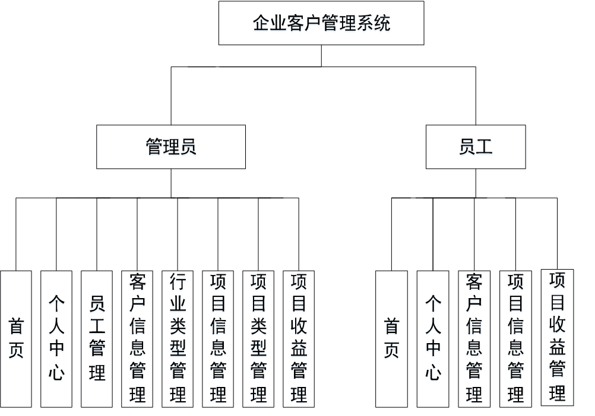
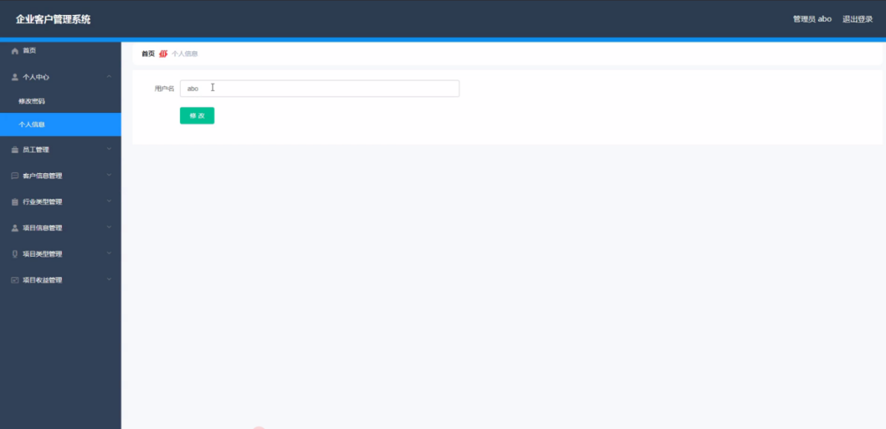
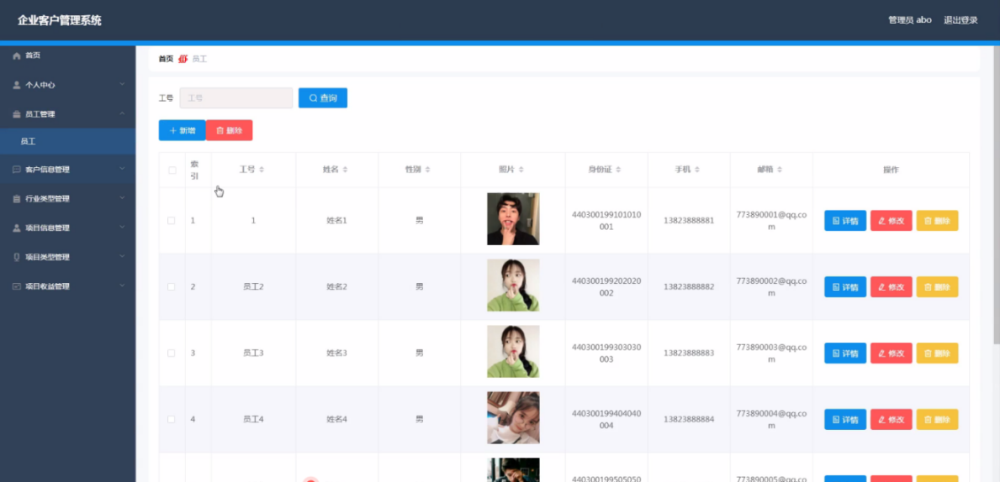
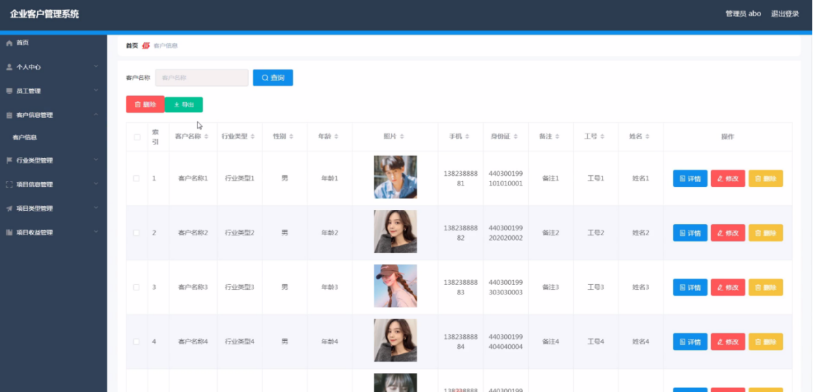
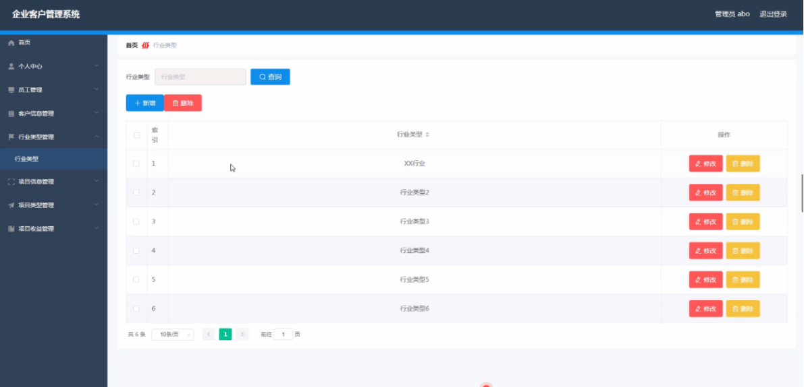
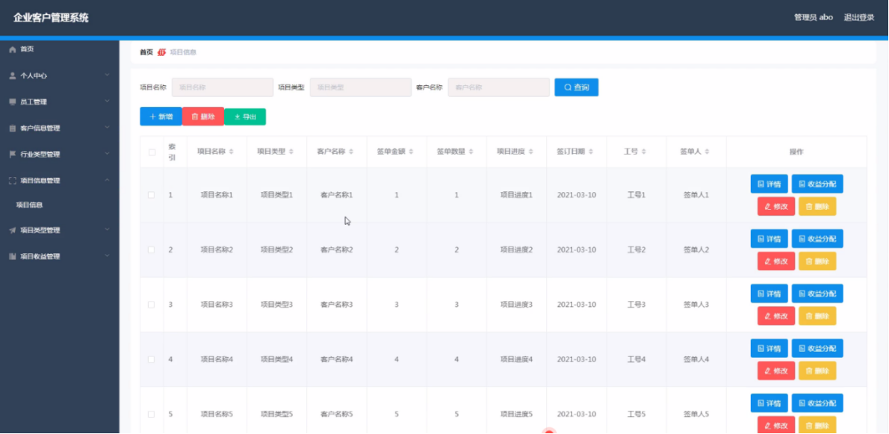
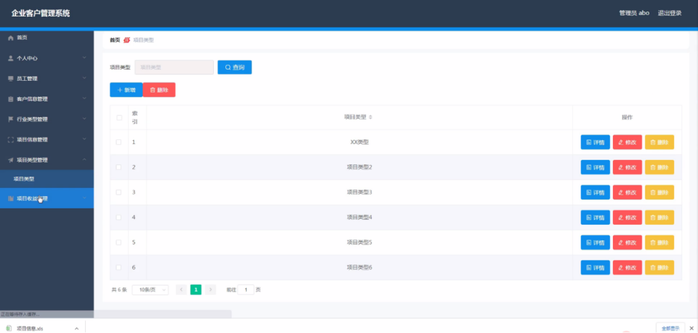
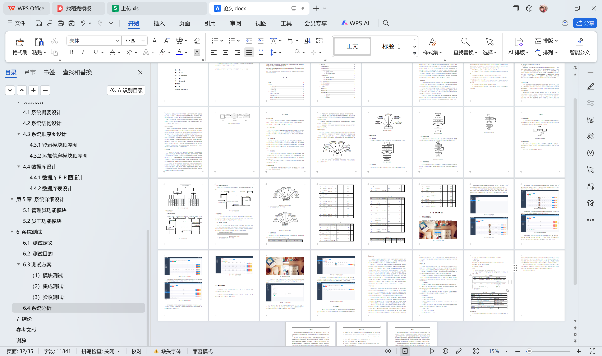

# springboot024-企业客户管理系统的设计与实现

>  博主介绍：
>  Hey，我是程序员Chaers，一个专注于计算机领域的程序员
>  十年大厂程序员全栈开发‍ 日常分享项目经验 解决技术难题与技术推荐 承接各类网站设计，小程序开发，毕设等。
>  【计算机专业课程设计，毕业设计项目，Java，微信小程序，安卓APP都可以做，不仅仅是计算机专业，其它专业都可以】

## 3000套系统可挑选，获取链接：https://chaerspol.github.io/

<b>QQ【获取完整源码】：674456564</b>

<b>QQ群【获取完整源码】：1058861570</b>

### 系统架构

> 前端：html | js | css | jquery | vue
>
> 后端：springboot | mybatis
> 
> 环境：jdk1.8+ | mysql | maven

# 一、内容包括
包括有  项目源码+项目论文+数据库源码+答辩ppt+远程调试成功

# 二、运行环境

> jdk版本：1.8 及以上； ide工具：IDEA； 数据库: mysql5.7及以上；编程语言: Java

# 三、需求分析

**3.1 可行性分析**

在系统开发之初要进行系统可行分析，这样做的目的就是使用最小成本解决最大问题，一旦程序开发满足员工需要，带来的好处也是很多的。下面我们将从技术上、操作上、经济上等方面来考虑这个系统到底值不值得开发。

**3.1.1 技术可行性**

本企业客户管理系统采用Spring Boot框架、JAVA编程语言和MYSQL数据库进行开发设计，作为计算机专业学生，在学校期间就接触到许多关于编程方面的知识，当然也包括各种编程软件，对他们的了解度也比较熟悉，所以技术开发上面还是有一定把握。

**3.1.2经济可行性**

我在设计该系统的时候主要是从节约成本出发，然后进行具体的系统的设计，在系统的设计过程中由于采用的所有工具以及技术支持全部都是免费的，因此不需要有任何的成本就可以进行该系统的设计。所用到的所有资源都是免费的，只要有网络就可以进行下载使用，不需要支付相应的费用，因此该项目在经济方面是完全可以实行的。

**3.1.3操作可行性**

本人自己就是学生，程序开发经验不足，在界面设计上面不会设计太复杂，要讲究简单好看，操作上要方便，不能让员工觉得不流畅。员工一旦进入操作界面，界面上就会有相应提示，跟着操作提示就可以找到对应的功能操作模块，对于员工来说免培训就能使用。
从上面几个部分的可行性分析得出，这次开发的企业客户管理系统在开发上面没有什么大问题，值得开发。

**3.2 系统性能分析**

（1）系统响应效率：页面响应时问应该在3秒以内，最长不能超过4秒，并支持至少10000人同时在线所有系统。

（2）界面简洁清晰：系统界面要求简单明了，容易操作，符合员工操作习惯。

（3）储存性高：因为企业客户管理系统中有很多的信息需要存储，因此对于系统的存储量有很大的要求，需要有一个强大的数据库的支持才能确保所有的信息都能安全稳定的进行存储。

（4）易学性：该系统在操作上必须简单好上手，没有很多复杂的操作，只需要简单的进行学习就能操作该系统。

（5）稳定性需求：开发的企业客户管理系统要求运行稳定，运行过程中无界面不清楚、字体模糊等现象。

# 四、功能模块

整个系统是由多个功能模块组合而成的，要将所有的功能模块都一一列举出来，然后进行逐个的功能设计，使得每一个模块都有相对应的功能设计，然后进行系统整体的设计。本企业客户管理系统结构图如图

# 五、部分效果图展示

图5-1管理员登录界面图【管理员登录，通过填写用户名、密码、角色进行登录，如图】

图5-2个人信息界面图【个人信息，在个人信息页面中可以通过填写用户名等内容进行修改、添加操作，如图】

图5-3员工管理界面图【在员工管理页面中可以填写工号、姓名、性别、照片、身份证、手机、邮箱等信息，还可以根据需要对员工管理进行详情、修改或删除等操作】

图5-4客户信息管理界面图【客户信息管理，在客户信息管理页面中可以填写客户名称、行业类型、性别、年龄、照片、手机、身份证、备注、工号、姓名等信息，并可根据需要对已有客户信息管理进行详情、修改或删除等操作，如图】

图5-5行业类型管理界面图【行业类型管理，在行业类型管理页面中可以填写行业类型等内容，并可根据需要对已有行业类型管理进行修改或删除等操作，如图】

图5-6项目信息管理界面图【项目信息管理，在项目信息管理页面中可以填写项目名称、项目类型、客户名称、签单金额、签单数量、项目进度、签订日期、工号、签单人等内容，并且根据需要对已有项目信息管理进行详情、收益分配、修改或删除等操作，如图】

图5-7项目类型管理界面图【项目类型管理，在项目类型管理页面中可以填写项目类型等内容，并且根据需要对已有项目类型管理进行详情、修改或删除等操作，如图】

 <b>完整文章</b>
 

 

## 3000套系统可挑选，获取链接：https://chaerspol.github.io/

<b>QQ【获取完整源码】：674456564</b>

<b>QQ群【获取完整源码】：1058861570</b>

